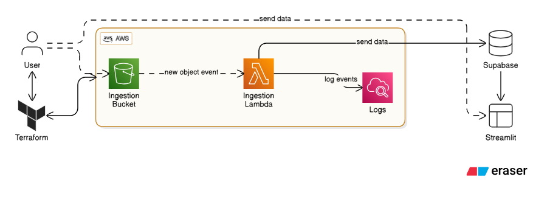
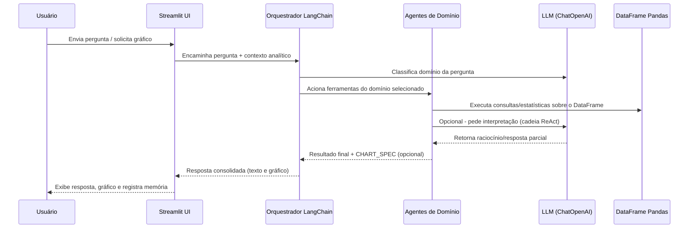
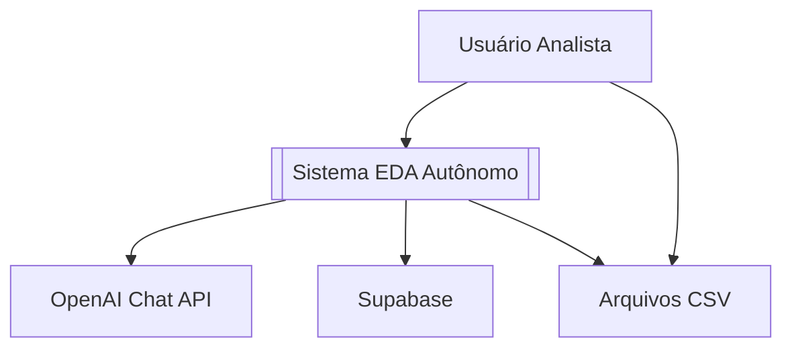
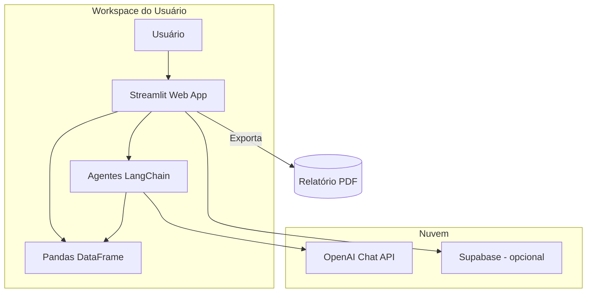

# Relatório Técnico - Agentes Autônomos

## 1. Frameworks Utilizados
- **Streamlit**: interface web para upload de CSV, configuração de credenciais e interação direta com o agente EDA.
- **LangChain**: construção do orquestrador e dos agentes de domínio (descritivo, padrões, anomalias, visualização) com memória conversacional.
- **OpenAI Chat API**: modelo linguístico para interpretar perguntas e produzir respostas em português, incluindo geração de gráficos via `CHART_SPEC`.
- **Plotly + Kaleido**: renderização de gráficos interativos e exportação para imagens utilizadas no relatório PDF.
- **scikit-learn / pandas / numpy**: suporte analítico (clusters, correlações, estatísticas, manipulação do DataFrame). 

### 1.1 Desenho de solução

## 2. Estrutura da Solução
- `app.py`: ponto central da aplicação Streamlit (upload de dados, EDA automático, interface de perguntas, geração de PDF).
- `agents/orchestrator.py`: orquestrador que classifica a intenção da pergunta e delega para o agente especializado correspondente.
- `agents/*.py`: implementações dos agentes com ferramentas específicas (estatísticas, padrões, outliers, geração de CHART_SPEC).
- `domain/analysis.py` e `domain/charts.py`: funções reutilizáveis para diagnósticos, correlações, outliers e utilidades de gráfico.
- Dockerfile + docker-compose: empacotamento da aplicação com todas as dependências, respeitando variáveis de ambiente via `.env`.

## 3. Fluxo de Uso
1. O usuário carrega um CSV (ou consulta Supabase) e informa as chaves diretamente na UI ou via `.env`.
2. O app executa um EDA inicial (tipos, estatísticas, valores ausentes, correlações) e exibe diagnósticos automáticos (padrões temporais, outliers, clusters).
3. Cada pergunta é enviada ao orquestrador LangChain, que chama o agente adequado e responde sempre em português.
4. Quando apropriado, o agente gera um bloco `CHART_SPEC` e a UI desenha o gráfico correspondente com Plotly.
5. O botão “Gerar conclusões do agente” produz um resumo automático dos principais achados.
6. O botão “Gerar PDF” consolida perguntas, respostas, conclusões e até 6 gráficos em `Agentes Autônomos - Relatório da Atividade Extra.pdf`.

## 4. Perguntas de Exemplo e Respostas
- **“Existem valores atípicos nos dados?”** – usa `outlier_report` e relata contagens, limites e sugestões de tratamento.
- **“Como esses outliers afetam a análise?”** – discute impacto nas médias, percentuais e recomendações práticas.
- **“Podemos remover, transformar ou investigar esses outliers?”** – sugere remoção, winsorização e transformações log.
- **Pergunta com gráfico** (ex.: “Gerar um gráfico de correlação das variáveis numéricas”) – retorna `CHART_SPEC` e cria o gráfico automaticamente.
- **“Quais as conclusões finais do agente?”** – o botão dedicado gera um resumo em linguagem natural que também vai para o PDF.

## 5. Conclusões do Agente
O agente mantém memória via `ConversationBufferMemory`, permitindo respostas contextualizadas e conclusões coerentes. Essa memória é utilizada para: 
- Relembrar perguntas anteriores ao gerar insights;
- Produzir o resumo final a partir das interações já realizadas;
- Exportar perguntas, respostas e gráficos relevantes para o PDF final.

## 6. Observações
- Antes de gerar o PDF, acione pelo menos quatro perguntas (uma delas com gráfico) e execute “Gerar conclusões do agente”.
- Preencha `OPENAI_API_KEY`, `SUPABASE_URL` e `SUPABASE_SERVICE_ROLE_KEY` (via `.env` ou UI) antes do upload dos dados.
- Recompile a imagem Docker com `docker compose build --no-cache app` sempre que alterar `app.py`, `agents/` ou `domain/`.

## 7. Diagramas

### 7.1 Sequência (Pergunta do Usuário)

### 7.2 C4 - Visão de Contexto

### 7.3 C4 - Visão de Containers

### 7.4 C4 - Visão de Componentes (Container Streamlit)

