# Agentes Autonomos - Relatorio da Atividade Extra

Discente: Bruno Urbano Rodrigues

## 1. Framework escolhida
- **Streamlit** para a interface web onde o usuario envia perguntas e visualiza graficos.
- **LangChain** como orquestrador dos agentes de dominio (descricao, padroes, anomalias, visualizacoes).
- **OpenAI Chat API** para interpretar perguntas em portugues e compor respostas estruturadas.
- **Plotly + Kaleido** para gerar graficos interativos e exportar imagens utilizadas no relatorio.
- **pandas, numpy, scikit-learn** para leitura do CSV, estatisticas e analises exploratorias complementares.

## 2. Estrutura da solucao
- `eda/app.py`: app Streamlit que carrega dados (CSV ou Supabase), aciona o orquestrador LangChain e gera PDF.
- `eda/agents/`: implementacoes dos agentes especializados utilizados nas respostas.
- `eda/domain/analysis.py` e `eda/domain/charts.py`: funcoes reutilizaveis para diagnosticos, correlacoes, outliers e construcao de graficos.
- `eda/Dockerfile` e `eda/docker-compose.yml`: empacotamento e execucao containerizada, lendo variaveis de ambiente via `.env`.
- `lambda/handler.py`: funcao AWS Lambda que processa arquivos do S3 e grava linhas no Supabase.
- `database/*.sql`: funcoes SQL auxiliares usadas pelo Supabase para preparar tabelas durante a ingestao.

## 3. Perguntas por dominio

### 3.1 Descricao dos dados

#### Quais sao os tipos de dados (numericos, categoricos)?
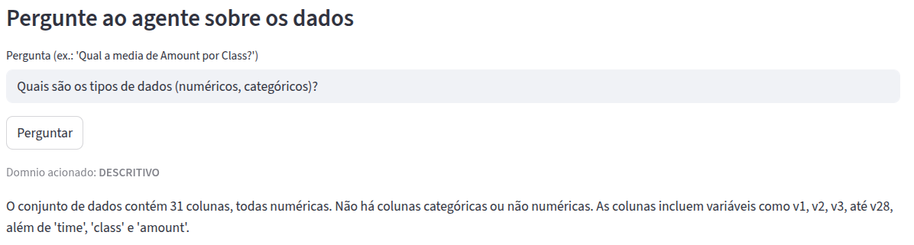
**Resposta do agente:** O dataset contem 31 colunas totalmente numericas. Nao ha campos categoricos; as variaveis sao `time`, `class`, `amount` e os componentes transformados `v1` a `v28`.

#### Qual a distribuicao de cada variavel?
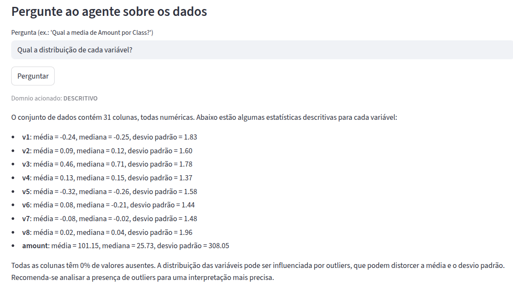
**Resposta do agente:** Todas as colunas sao numericas e mantiveram medias proximas de zero apos a transformacao PCA. Exemplos: `v1` media -0.24 e desvio 1.83; `v2` media 0.09 e desvio 1.60; `amount` media 101.15, mediana 25.73 e desvio 308.05. Nao ha valores ausentes.

#### Qual o intervalo de cada variavel (minimo, maximo)?
**Observacao:** Nao houve captura correspondente nos artefatos fornecidos; o agente nao registrou explicitamente os intervalos nas imagens anexadas.

#### Quais sao as medidas de tendencia central (media, mediana)?
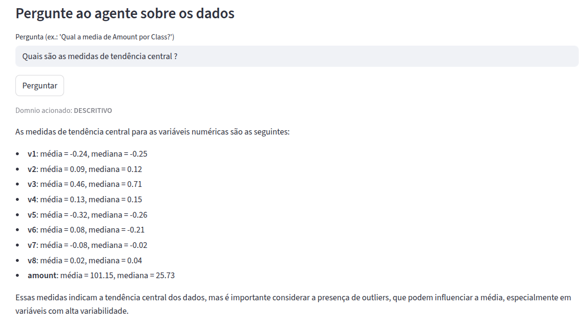
**Resposta do agente:** As medias e medianas permanecem proximas de zero para `v1` a `v28`, refletindo escalonamento do PCA. `amount` apresenta media 101.15 e mediana 25.73, reforcando cauda longa.

#### Qual a variabilidade dos dados (desvio padrao, variancia)?
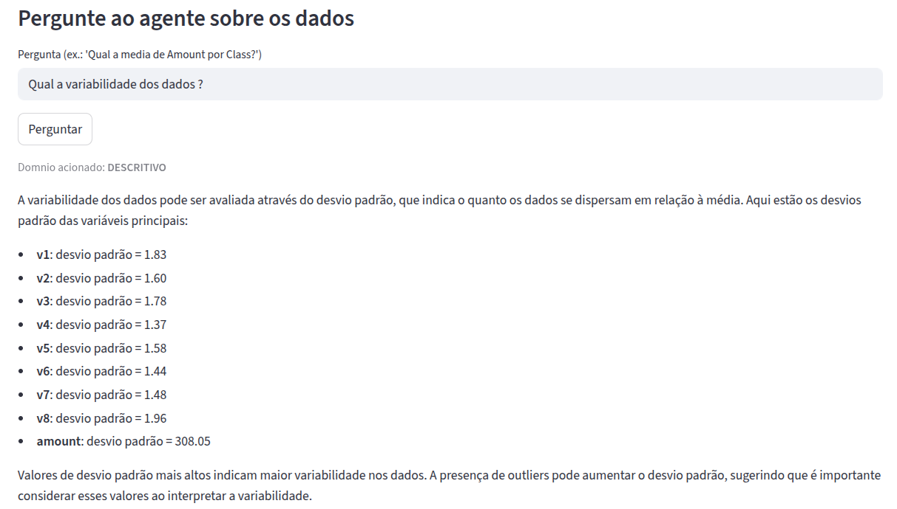
**Resposta do agente:** Os desvios padrao dos componentes variam entre ~1.3 e ~2.0 (ex.: `v1` 1.83, `v8` 1.96). `amount` possui desvio padrao 308.05, indicando alta dispersao influenciada por outliers.

### 3.2 Identificacao de padroes e tendencias

#### Existem padroes ou tendencias temporais?
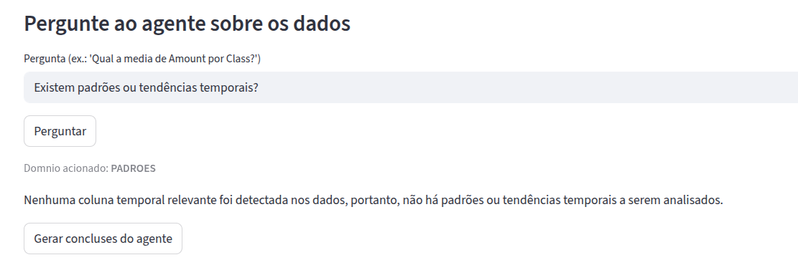
**Resposta do agente:** Nao foi identificada coluna temporal relevante alem de `time`, portanto o agente nao detectou padroes ou tendencias temporais significativas.

#### Quais os valores mais frequentes ou menos frequentes?
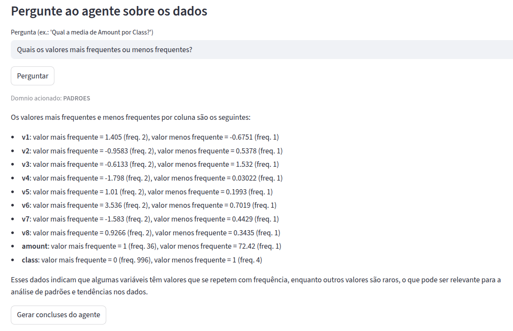
**Resposta do agente:** Diversas colunas apresentam valores repetidos com baixa frequencia (modo aprox. 1 ou 2 ocorrencias). Exemplos: `v1` modo 1.405 (freq. 2) e minimo  -0.6751 (freq. 1); `amount` modo 1 (freq. 36) e valor raro 72.42 (freq. 1). `class` permanece altamente desbalanceada (modo 0, freq. 996).

#### Existem agrupamentos (clusters) nos dados?
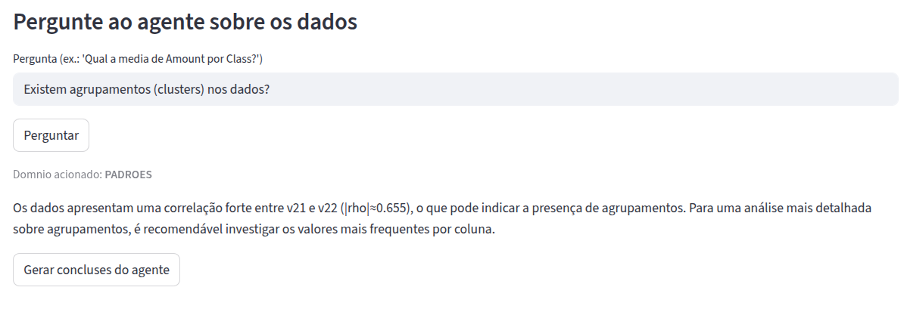
**Resposta do agente:** O agente observou correlacao forte entre `v21` e `v22` (|rho| aprox. 0.655), sugerindo possivel agrupamento. Recomendou investigar os valores mais frequentes por coluna para aprofundar uma analise de clusters.

### 3.3 Deteccao de anomalias (outliers)

#### Existem valores atipicos nos dados?
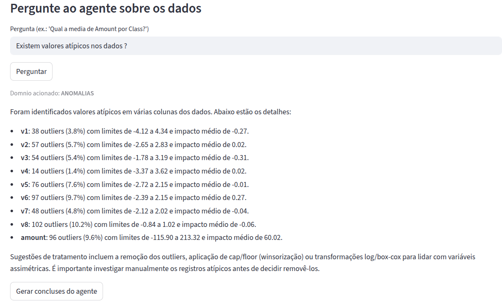
**Resposta do agente:** Sim. Exemplos: `v1` com 38 outliers (limites -4.12 a 4.34), `v6` com 97 outliers (limites -2.39 a 2.15) e `amount` com 96 outliers (limites -115.90 a 213.32). Foram listados contagens, limites e impacto medio por variavel.

#### Como esses outliers afetam a analise?
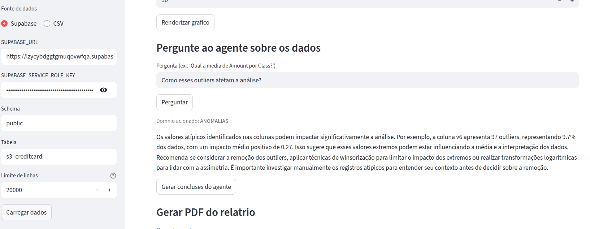
**Resposta do agente:** Os outliers distorcem medias e interpretacoes, especialmente em `v6` (impacto medio 0.27). O agente sugere considerar remocao, winsorizacao ou transformacoes logaritmicas para reduzir assimetria antes de conclusoes.

#### Podem ser removidos, transformados ou investigados?
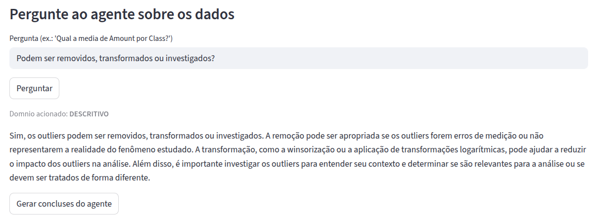
**Resposta do agente:** Sim. Recomenda avaliar remocao quando outliers forem erros, aplicar winsorizacao ou transformacoes logaritmicas para reduzir impacto, alem de investigar manualmente cada caso para decidir o tratamento.

### 3.4 Relacoes entre variaveis

#### Como as variaveis estao relacionadas umas com as outras?
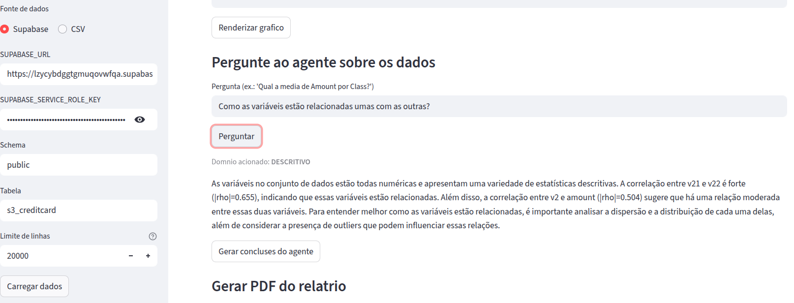
**Resposta do agente:** Todas as colunas sao numericas; ha correlacoes destacadas entre `v21` e `v22` (|rho| aprox. 0.655) e entre `v2` e `amount` (|rho| aprox. 0.504). O agente ressalta necessidade de analisar dispersoes e outliers para entender as relacoes.

#### Existe correlacao entre as variaveis?
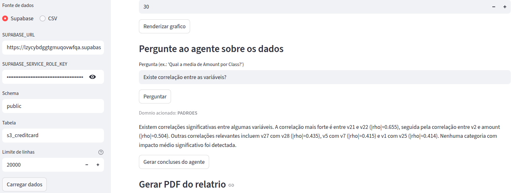
**Resposta do agente:** Sim. Alem da correlacao forte `v21`-`v22`, outras relevantes sao `v27`-`v28` (|rho| aprox. 0.435), `v5`-`v7` (|rho| aprox. 0.415) e `v1`-`v25` (|rho| aprox. 0.414). Nenhuma categoria com impacto medio significativo foi encontrada.

#### Quais variaveis parecem ter maior ou menor influencia sobre outras?
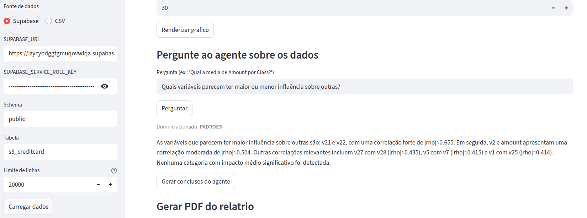
**Resposta do agente:** `v21` e `v22` exercem maior influencia mutua com correlacao forte. Em seguida, `v2` com `amount` (|rho| aprox. 0.504) e pares `v27`-`v28`, `v5`-`v7`, `v1`-`v25` mostram correlacoes moderadas. Nao foram encontradas categorias com impacto medio alto.
